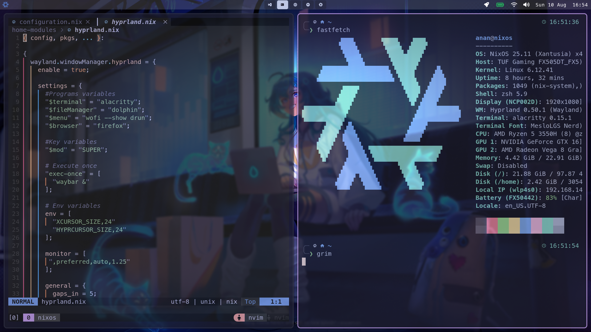

# 🛠️ My NixOS System — Appearance & Tools

This repository contains **the full configuration** of my system, designed to be **minimalistic, fast, and aesthetic**, combining the power of **NixOS** with a modern graphical environment and efficient development tools.

## ✨ Technologies & Tools

- **🐧 NixOS** — Declarative and reproducible operating system. All configuration is managed with Nix and Home Manager for full portability.
- **🖥️ Hyprland** — Fast and highly configurable dynamic Wayland compositor with smooth effects and support for both tiling and floating windows.
- **📊 Waybar** — Customizable status bar showing system info, battery, network, and more, fully integrated with Hyprland.
- **📝 Neovim** — Ultra-fast and extensible text editor configured in Lua for maximum productivity.
- **🔀 Tmux** — Terminal multiplexer to split sessions, work in parallel, and keep processes persistent.

## 🎯 Setup Goals
- **Speed**: Optimize each tool for immediate response.
- **Aesthetics**: Maintain a clean and consistent design across all applications.
- **Productivity**: Quick access, custom shortcuts, and automation of common tasks.
- **Reproducibility**: Fully managed with Nix to replicate the environment on any machine.

## ⌨️ Main Keyboard Shortcuts (Hyprland)
| Key Combination  | Action            |
|------------------|-------------------|
| `SUPER + Return` | Open terminal     |
| `SUPER + B`      | Open web browser  |

## 📷 Screenshots

---

💡 **Note:** This setup is designed for users who want a minimal yet powerful workflow, combining classic tools with the latest in Wayland desktop environments.

---

🚧 **Project Status:**  
This repository **is under construction** 🏗️ and in **continuous improvement**, so configuration, appearance, and features may change over time.  
Every commit is a step toward a more polished and efficient working environment!

